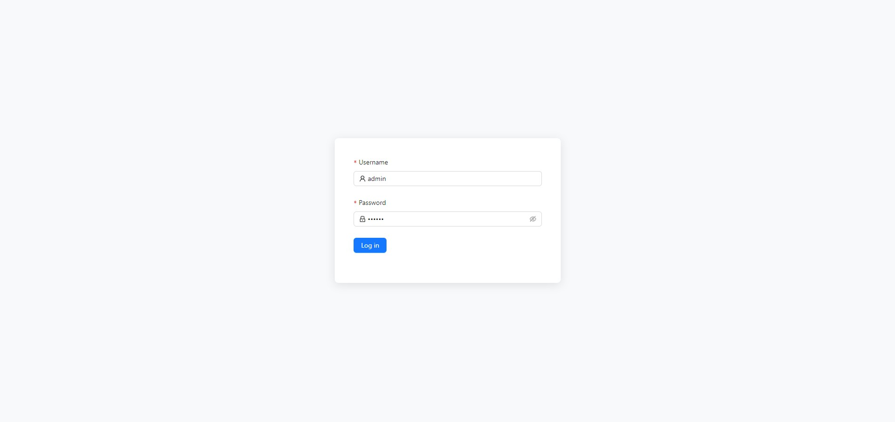
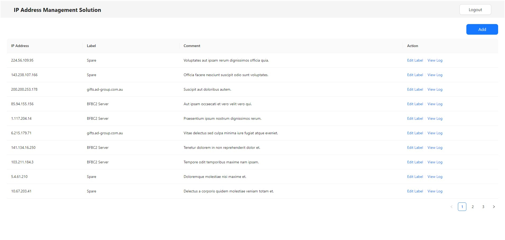

# IP Address Management Solution

## Description

The project features a Laravel backend, leveraging Docker for efficient containerization, and a Vue 3 frontend utilizing Ant Design Vue for a modern and responsive user interface.




## Prerequisites

- Docker
- Docker Compose
- PHP 8.3
- Laravel 11.x
- Node.js 20.x
- MySQL 8.x
- Redis
- Vue 3

## Setup

To set up the project, follow these steps:

1. **Clone the Repository**
   ```bash
   git clone https://github.com/arielaquin0/ipams
   cd ipams

2. **Build and Start Docker Containers**
    ```bash
   ./setup.sh

3. **Access the Application**
    ```bash
   http://localhost:3000
